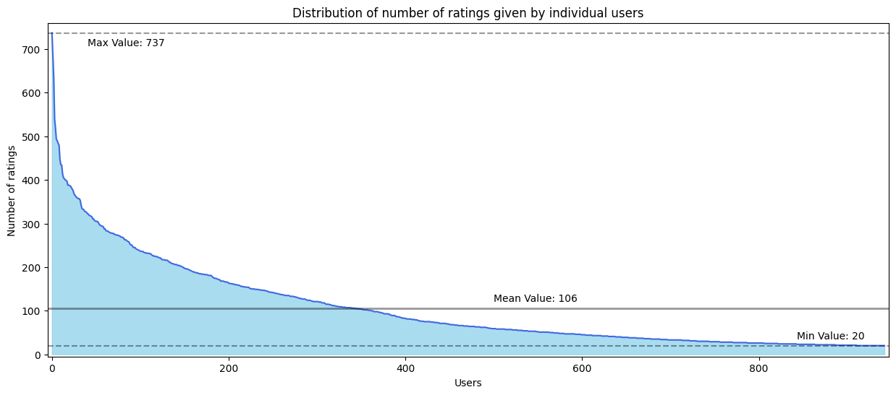
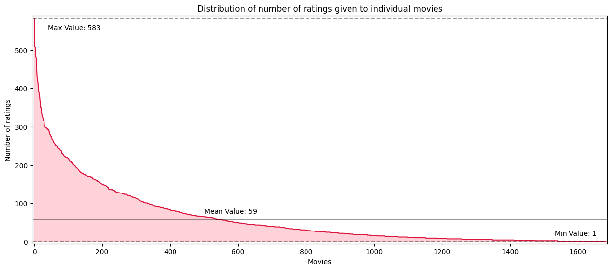

# Introduction
This is a report of the work done to develop a movie recommender system trained on MovieLens 100K dataset. It contains an overview of data analysis, info on implemented models, their pros&cons, and final results. 

Author of work: Kirill Samburskiy

# Data analysis
The [MovieLens 100K](https://grouplens.org/datasets/movielens/100k/) dataset was used for this project. It contains information on 943 users and 1682 movies, and a total of 100k ratings. Here is the plot showing the distribution of number of ratings given by each user:

Each user rated at least 20 movies, but the the mean number of ratings is 106. It is easier to recommend movies to users who rated more movies, since there is more information about them.

Here is the plot of number of ratings per movie:

As opposed to users, there are movies that have as little as 1 rating, meaning it might be challenging to find users to recommed such movies to. Nevertheless, mean number of ratings per movie is 59, which is enough to train a recommender system.

The mean rating in the dataset is about 3.5, meaning it is biased towards positive rating. The most popular rating is 4 stars, appearing about 34k times in the dataset. The least popular rating is 1 star, only appearing around 6k times.

The demographic data of users is also imbalanced. There are more than 2 times more male users than female. There are also about 2 times more student users than any other single occupation.

Most of the data on movies (e.g. video release data, url, title (arguably)) is not very useful. The distribution of movies among genres is also very imbalanced, with drama being the most common (almost half of all movies) and Western / Film-Noir / Fantasy genres being least common.

The timespan in the dataset is from October 1997 till near the end of April 1998.

> For more details on data analysis, refer to `notebooks/1.0-data-exploration.ipynb`

# Model Implementation
The model implemented is a latent factor based neural network. It only uses ratings data, and does not use demografic data or metadata on movies. The architecture is as follows:

* UserEmbedding(dim=128) + ItemEmbedding(dim=128)
* Concatenate user embedding and item embedding
* Fully-connected layer with 256 inputs and 1 output

The model gets indices of users and indices of items. It then has to return the predicted rating for the corresponding user-item interactions.

After the model is trained, the recommendations can be obtained by passing all existing movie ids along with the target user id to the model, obtaining the predicted ratings for each of the movies. The resulting list may be sorted by ratings, and items at the top of list may be selected as recommendations (except for the already rated items). You can find the implementation of such recommendation algorithm in `src/models/utils.py` file.

# Model Advantages and Disadvantages
> Note: the following lists are not necessarily exhaustive

Advantages:
* The model is really simple and lightweight. 
* Fast training and inference
* Decent performance

Disadvantages:
* The model does not take additional user/item information into account
* Cold start problem unaddressed
* Has to be retrained/finetuned for new users/items/ratings

# Training Process
The pre-made splits from MovieLens dataset are used for training. 5-fold cross-validation is used to verify model's performance on different splits. For each split the training is run for 10 epochs, with the use of Adam optimizer (lr = 1e-3, weight_decay = 1e-4) and MSE as loss function. The data is loaded in mini batches of size 32, the training data is shuffled.

During training the user ids and item ids are passed to the model. Model computes 128-dimensional embeddings for both users and items, concatenates embeddings, and passes the resulting vector through the fully-connected layer to get predicted ratings.

You can find the implementation of trainin loop in `src/models/train.py`.

# Evaluation
The evaluation of the model is performed on the validation part of the dataset, which is possible since the validation data does not affect the training (although the loss for validation set is computed, it is only used to report model's performance on unseen data).

4 metrics are calculated during evaluation: MSA, MSE, RMSE, and F1 score, the most interesting ones being RMSE and F1. F1 score is calculated by classifying movies in relevant vs. irrelevant recommendations. If the predicted rating is above 3.5, the recommendation is considered relevant.

# Results
Here are the evaluation results of the final model:

||Split 1|Split 2|Split 3|Split 4|Split 5|Average|
|---|---|---|---|---|---|---|
|MSA|0.7647|0.7502|0.7502|0.7454|0.7514|0.7524|
|MSE|0.9323|0.9072|0.8983|0.8890|0.8897|0.9033|
|RMSE|0.9656|0.9525|0.9478|0.9428|0.9432|0.9504|
|F1|0.7399|0.7371|0.7152|0.7228|0.7244|0.7279|
|Training loss|0.8847|0.8876|0.8888|0.8894|0.8907|0.8882|

With average RMSE below 1 and F1 of 0.73 the model's performance is decent, although far from state-of-the-art models. This can be largely because the additional data is left unused.
